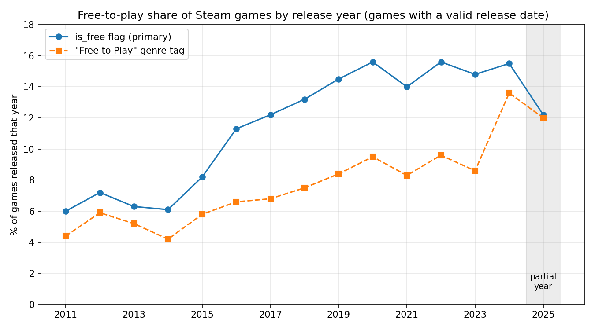
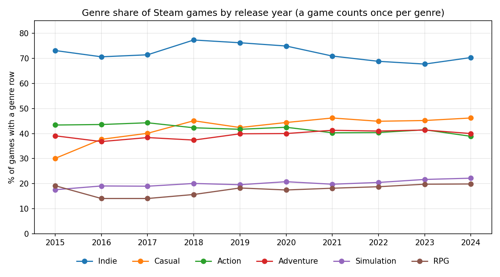
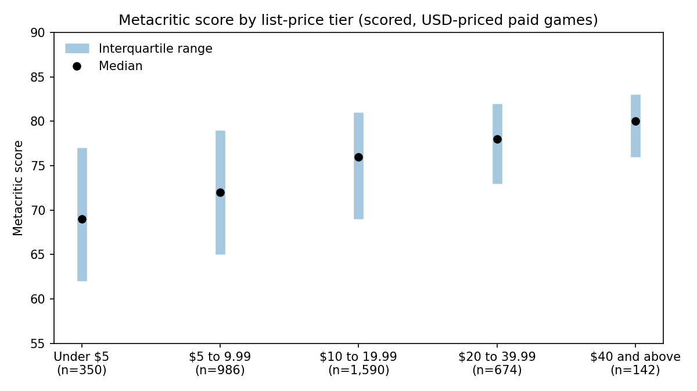
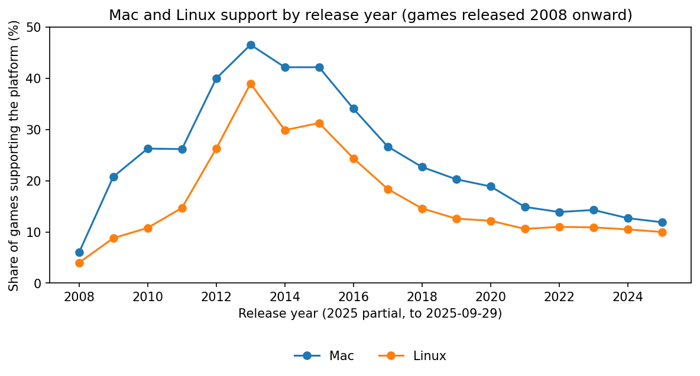

# Steam Games: SQL and EDA

A data-cleaning and SQL analysis project on the Steam Dataset 2025. The raw catalogue of 239,664 store listings is cleaned, validated and exported as a relational SQLite database of 150,279 games, which is then analysed in SQL to answer six questions about free games, genres, publishers, pricing and reception, platforms and discounts.

**Status:** complete. Notebook 01 cleans and exports the data; notebook 02 answers the six questions.

## Demo

Every result in `notebooks/02_sql_analysis_and_eda.ipynb` is a SQL query; pandas and matplotlib only display it. Four of the six questions have a figure. All six are summarised under Key results.

**Free games as a share of releases, by release year.** Free games grow from about 2-3% of releases (2006-2010) to 14.0-15.6% for each year 2019-2024.



**Genre share by release year.** Indie ranks first every year from 2015 to 2024, and Casual overtakes Action in 2018. A game counts once per genre, so shares add to more than 100%.



**Metacritic score by list-price tier.** Among 3,742 scored paid games, the median rises from 69 to 80 across the price tiers. Only 2.8% of games have a score, so this describes scored games only.



**Mac and Linux support by release year.** Support peaks for 2013 releases (46.6% Mac, 39.0% Linux) and falls to 11.9% and 10.0% for 2025 releases. The share falls because the number of games grew faster, not because fewer games support these platforms.



## How to run

**Requirements:** Python 3.12 and the packages in `requirements.txt`.

```bash
pip install -r requirements.txt
```

**1. Get the data.** Download the Steam Dataset 2025 from Kaggle
(`crainbramp/steam-dataset-2025-multi-modal-gaming-analytics`) and use only the
`steam_dataset_2025_csv_package_v1` folder. The `reviews.csv` file is not used.

**2. Build the raw database.** In DB Browser for SQLite (standard build), create a new database at
`data/steam_data.sqlite`. Then use **File > Import > Table from CSV file** for each of these eleven files:
`applications`, `genres`, `categories`, `developers`, `publishers`, `platforms`,
`application_genres`, `application_categories`, `application_developers`,
`application_publishers`, `application_platforms`.

Accept the dialog defaults and set only the table name to the file name without `.csv`. The defaults are:
"Column names in first line" **unticked**, comma separator, double-quote character, UTF-8, "Trim fields" ticked.
Because the header is not treated as column names, it is imported as the first data row and every column is text.
The notebook accounts for both facts. Do not tick "Column names in first line", or the notebook will drop a real row from each table.

**3. Run notebook 01.** Open `notebooks/01_data_cleaning_and_setup.ipynb` in JupyterLab and choose
**Kernel > Restart Kernel and Run All Cells**. It writes `data/processed/steam_clean.sqlite` (about 151 MB).
The `data/` folder is gitignored, so this file must be regenerated locally.

**4. Run notebook 02.** Open `notebooks/02_sql_analysis_and_eda.ipynb` and run all cells. It opens the cleaned
database read-only through DuckDB and saves the figures to `docs/figures/`. The first run needs an internet
connection, because DuckDB downloads its SQLite extension once.

The schema is documented in [`docs/data-dictionary.md`](docs/data-dictionary.md).

## Approach

**Cleaning (notebook 01).** The notebook follows a fixed sequence: load, inspect, missing values, duplicates,
categorical and numerical checks, dates, relational integrity, cleaning, validation, export. Every cleaning
decision is explained in a markdown cell beside the code. Before export, 54 automated checks confirm key
integrity, foreign keys, value ranges and the counts recorded in earlier sections. The export enforces foreign
keys and is verified by reopening the file with independent connections.

| Stage | Rows |
|---|---|
| Raw listings | 239,664 |
| Games (`type = 'game'`) | 150,279 |
| Paid games | 131,285 |
| Paid games with a price | 90,311 |
| Paid games with a USD price | 88,943 |

**Analysis (notebook 02).** Every analysis is a SQL query first, run through DuckDB on a read-only connection;
pandas and matplotlib only display the result. Each question states its definitions before any number is
computed, checks coverage and sample sizes first, and ends with a conclusion cell that lists its limits.
Where a pooled difference could come from a different mix of release years, the comparison is repeated inside
release-year cohorts. Explanations that were not tested are labelled as hypotheses.

## Key results

All results are associations in observational data. Each question's limits are stated in its conclusion cell.

| Question | Main finding | Main limit |
|---|---|---|
| Q1: Free share by release year | Free games rise from about 2-3% of releases (2006-2010) to 14.0-15.6% for each year 2019-2024 (12.2% in partial 2025). The `is_free` flag is used as the definition. | 30.0% of free games lack the Free to Play tag. The 2024-25 convergence of tag and flag shares comes only from free games, and its cause was not tested. |
| Q2: Genre mix by year | Indie ranks first every year 2015-2024 (67.7-77.3%). Casual overtakes Action in 2018 and stays in a 42.4-46.2% band. Action falls from 44.3% (2017) to 38.9% (2024). | A game counts once per genre, so shares exceed 100%. The size of Casual's gain depends on the comparison window. |
| Q3: Publisher size vs reception | The share of a publisher's games with recommendations reported rises from 5.7% (1 game) to 32.8% (21+ games), and holds in every release-year cohort. The median recommendation count among reporting games is flat (322-353). | Recommendations measure reach, not quality. Part of the pooled gap is composition. The Metacritic comparison uses small, selected samples. |
| Q4: Price tier vs Metacritic | Among 3,742 scored paid games, the median score rises with price: 69, 72, 76, 78, 80. The gap between Under USD 10 and USD 20+ is about 6 points in 2011-2015 and 2016-2019, and 1 point in 2020-2025. | Only 2.8% of games have a score, and the scored share varies from 0.6% to 15.6% by tier. Price is the scrape-date list price. |
| Q5: Platform support | Windows is at 99.7-100% in every year. Mac and Linux peak for 2013 releases (46.6% and 39.0%) and fall to 11.9% and 10.0% for 2025. The fall is a growing denominator, not fewer games (Mac 216 to 2,569 from 2013 to 2024). | Support is the flag at scrape time, not at release. The cause of the peak and decline was not tested. |
| Q6: Discounts at scrape date | On 2025-09-29, 10.5% of games with a price were on sale. The share rises with list price, from 9.4% to 15.7%, and the pattern holds in the two largest release-year cohorts. | One-day snapshot. Free games and 40,974 paid games have no discount value. |

## Data-quality findings

- **Platform flags contradicted the junction table.** The raw `supports_mac` and `supports_linux` flags were true for about 99.9% of apps, while the platform table gave about 23% and 17%. The junction table is treated as the source of truth and the flags are dropped.
- **Translated genres.** 154 genre IDs were translations of each other and were consolidated into 34 canonical genres (33 occur on games).
- **Categories** were filtered to English entries; 0.35% of category rows were dropped.
- **Prices** are stored in cents across 33 currencies. Only USD listings are converted (no exchange-rate data), so price analysis covers USD listings only.
- **Missing prices.** 31% of paid games have no price. This is not explained by unreleased status and is concentrated in recent listings, so price analyses skew toward older listings.
- **Discount** is a point-in-time snapshot at the scrape date (2025-09-29), not a price history.
- **Sparse fields.** Metacritic scores are missing for 97.2% of games and recommendations for 86.8%; both support subsample analysis only.
- **Dates.** 906 listings are future-dated, including sentinel-like years, and three games carry an epoch-zero date. Dates outside 1990-01-01 to 2025-09-29 are set to null and unreleased listings are flagged. 2025 is a partial year.
- **Relational coverage.** 7,266 games (4.8%) have no genre, category, developer or publisher rows and are flagged `has_relational_metadata = 0`.
- **Developers and publishers** sharing a trimmed, lowercased name were merged. Other spelling variants remain.
- **`required_age`** is 0 for 99.1% of games and is a weak variable.
- **Entity key.** `appid` is the key; no name-based deduplication was applied.

## What I would improve

- Replace the manual DB Browser import with a script that builds the raw database directly from the CSVs.
- Normalise remaining developer and publisher name variants beyond case and whitespace.
- Investigate why so many recent listings have no price, since it limits every price analysis.
- Test the explanations left open in the analysis, for example why the Free to Play tag and the free flag converge in 2024-25, and why the Mac and Linux share peaks for 2013 releases.
- Use release-time rather than scrape-time platform and price data if a source with history becomes available.
- Add tests for the cleaning logic and the SQL queries outside the notebooks.